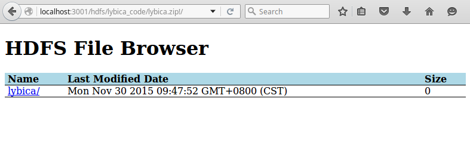
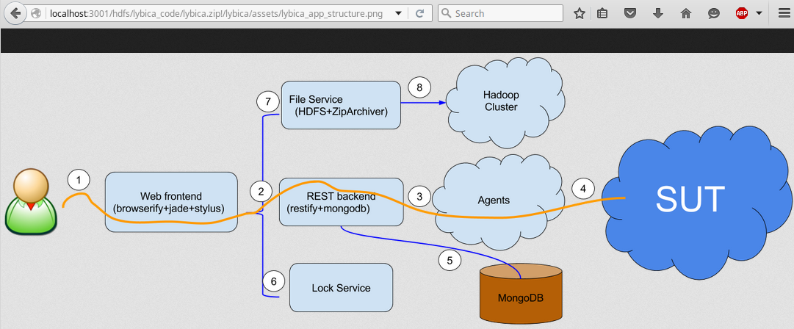

- [lybica-hdfs-viewer](#lybica-hdfs-viewer)
	- [Preparation](#preparation)
    - [Example](#example)
	- [Deployment](#deployment)
		- [POST example](#post-example)
		- [Screenshot](#screenshot)

# lybica-hdfs-viewer

`lybica-hdfs-viewer` is a node application that can be the bridge of the end user and HDFS cluster.

## Preparation

You should have a HDFS cluster with webhdfs enabled before running this application.
About how to setup a HDFS cluster, you can refer to http://hadoop.apache.org/docs/current/hadoop-project-dist/hadoop-common/ClusterSetup.html.

### Example

We have 5 computers, their IP addresses are: 10.0.0.1, 10.0.0.2, 10.0.0.3, 10.0.0.4, 10.0.0.5. Copy hadoop (I choose version 2.7.1) to all of these five nodes (/hadoop/install/hadoop). Assign them as below:

* 10.0.0.1     ->    hadoop namenode
* 10.0.0.2     ->    hadoop secondary namenode
* 10.0.0.3     ->    hadoop datanode 1
* 10.0.0.4     ->    hadoop datanode 2
* 10.0.0.5     ->    hadoop datanode 3

The `core-site.xml` content is as below:

```xml
<?xml version="1.0" encoding="UTF-8"?>
<?xml-stylesheet type="text/xsl" href="configuration.xsl"?>
<configuration>
    <property>
        <name>fs.defaultFS</name>
        <value>hdfs://10.0.0.1:9000</value>
    </property>
    <property>
        <name>hadoop.tmp.dir</name>
        <value>/hadoop/temp</value>
    </property>
    <property>
        <name>hadoop.logfile.size</name>
        <value>10000000</value>
    </property>
    <property>
        <name>hadoop.logfile.count</name>
        <value>5</value>
    </property>
</configuration>
```

The `hdfs-site.xml` content is as below:

```xml
<?xml version="1.0" encoding="UTF-8"?>
<?xml-stylesheet type="text/xsl" href="configuration.xsl"?>
<configuration>
    <property>
        <name>dfs.replication></name>
        <value>3</value>
    </property>
    <property>
        <name>dfs.namenode.name.dir</name>
        <value>/hadoop/name</value>
    </property>
    <property>
        <name>dfs.datanode.data.dir</name>
        <value>/hadoop/data</value>
    </property>
    <property>
        <name>dfs.webhdfs.enabled</name>
        <value>true</value>
    </property>
    <property>
        <name>dfs.hosts.exclude</name>
        <value>/hadoop/install/hadoop/etc/hadoop/excludes</value>
        <final>true</final>
    </property>
    <property>
        <name>dfs.namenode.http-address</name>
        <value>10.0.0.1:50070</value>
    </property>
    <property>
        <name>dfs.namenode.secondary.http-address</name>
        <value>10.0.0.2:50090</value>
    </property>
    <property>
        <name>dfs.namenode.datanode.registration.ip-hostname-check</name>
        <value>false</value>
    </property>
    <property>
        <name>dfs.permissions.enabled</name>
        <value>false</value>
    </property>
</configuration>
```

`masters` content is as below:

```
10.0.0.1
10.0.0.2
```

`slaves` content is as below:

```
10.0.0.3
10.0.0.4
10.0.0.5
```

## Deployment

To deploy `lybica-hdfs-viewer`, you should make sure `nodejs` was installed correctly.

1. `git clone https://github.com/lybicat/lybica-hdfs-viewer.git`
1. `cd lybica-hdfs-viewer`
1. `npm install`
1. `export HDFS_HOST=10.0.0.1` # HDFS_USER, HDFS_PORT can also be specified
1. `node app.js`
1. `visit http://localhost:3001/hdfs/<file path>!/` to have a try, make sure <file path> exist on the HDFS.

### POST example

```javascript
// nodejs script

var fs = require('fs');
var request = require('request');

var req = request.post('http://localhost:3001/hdfs');
fs.createReadStream(__dirname + '/data/zipfile1.zip').pipe(req);

req.on('response', function(res) {
  console.log(res.headers.hdfsurl);
});

```

```python
# python script

import requests

def file_iter(file_path):
    with open(file_path, 'rb') as fp:
        for chunk in fp:
            yield chunk

response = requests.post('http://localhost:3001/hdfs', data=file_iter('zipfile1.zip'))
print response.headers['hdfsurl']
```

### Screenshot

* View the root path of the zip file
    
* View the file content of the zip file
    
